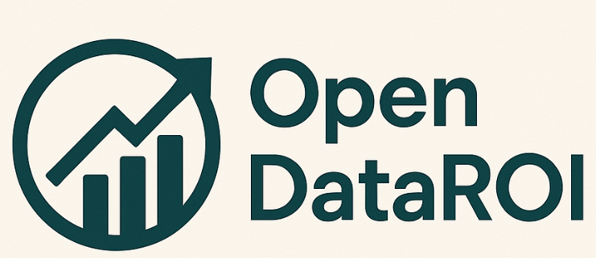

# Open DataROI

Open-source tool to quickly estimate the ROI of data initiatives based on investment costs, development time, and expected returns. Ideal for managers and data professionals.


https://github.com/user-attachments/assets/f54cb7b7-a95e-4963-a0f7-d327a2516b4c


---

## 📦 Features

- ROI estimation with minimal input
- FastAPI backend to use as a service
- Interactive frontend using Streamlit
- Return and break-even visualization with charts
- Export results to PDF and CSV
- Automated testing with Pytest
- Scenario simulations: optimistic, realistic, pessimistic
- Pre-filled use case templates for quick assessments
- Easy deployment using Docker Compose

---

## ▶️ How to Run Locally

### Backend (FastAPI)

```bash
cd backend
uvicorn main:app --reload
```

### Frontend (Streamlit)

```bash
cd frontend
streamlit run app.py
```

### With Docker (Full Stack)

```bash
docker-compose up --build
```

Access:

- http://localhost:8501 → Interactive dashboard
- http://localhost:8000/docs → API documentation (Swagger)

---

## 📤 Exporting Results

### 📄 PDF

- **Endpoint:** `POST /export/pdf`
- **Description:** Returns a formatted report with key ROI metrics

### 📊 CSV

- **Endpoint:** `POST /export/csv`
- **Description:** Returns a file with cumulative monthly profit

#### Example Payload (JSON)

```json
{
  "scenarios": [
    {
      "name": "realistic",
      "investment_cost": 10000,
      "monthly_operational_cost": 2000,
      "num_people": 3,
      "development_months": 4,
      "monthly_return_estimate": 5000,
      "time_to_results_months": 6,
      "technologies": ["Python", "BigQuery"]
    }
  ]
}
```

---

## ✅ Automated Testing

To run ROI logic tests:

```bash
pytest tests/
```

Tests include ROI calculation, total cost, and break-even scenarios.

---

## 🛠 Requirements

Install dependencies with:

```bash
pip install -r requirements.txt
```

### `requirements.txt`

```txt
fastapi==0.110.0
uvicorn==0.29.0
pydantic==2.6.4
streamlit==1.32.2
plotly==5.21.0
requests==2.31.0
pytest==8.1.1
matplotlib==3.8.3
reportlab==4.1.0
kaleido==0.2.1
```

---

## ✨ Contributions

Pull requests are welcome! Feel free to open an issue to suggest improvements or report bugs.

---

## 📄 License

MIT License
